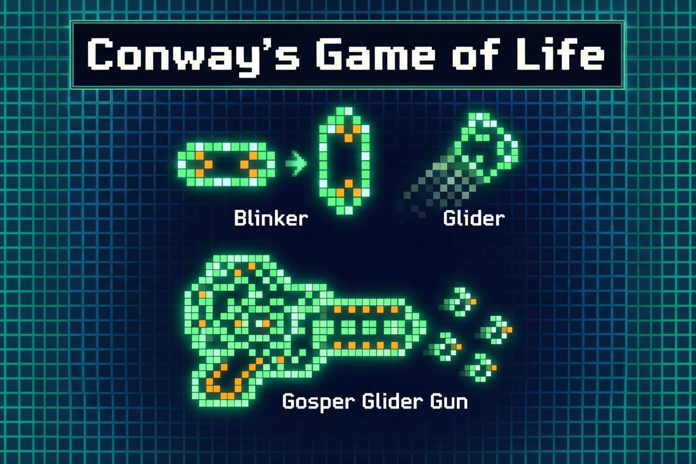

Imagine a universe where **the laws of nature fit on a sticky note**. In 1969, mathematician John Conway did exactly that, he sketched out **four simple rules** that birthed a digital cosmos on graph paper. Cells on an endless grid would live or die by these minimalist laws, and from this austere setup, complex “lifeforms” emerged. It sounds like sci-fi. Yet Conway’s creation, grandly titled the _Game of Life_, has been captivating hackers, mathematicians, and philosophers for decades. How can something so simple unleash phenomena so rich that it hints at the workings of our own universe? Let’s dive into the playful **world of Life**, where _blinkers_ blink, _gliders_ glide, and even **self-replicating creatures** hide, all to explore how immense complexity blossoms from simple, deterministic rules.
## Background: A Game of No Players and Infinite Grid

Conway’s Game of Life is often called a _zero-player game_ meaning once you set it up, it runs itself. The “board” is an infinite checkerboard grid, and each square (cell) is either alive (filled) or dead (empty). You, the player, simply choose an initial pattern of live cells then sit back and watch. At each tick (generation), all cells update simultaneously according to Conway’s four concise rules the "_genetic laws_", as he called them:

1. **Birth:** A dead cell with exactly 3 live neighbours becomes alive in the next generation. It’s as if three’s a crowd that _sparks_ new life.
2. **Survival:** A live cell with 2 or 3 neighbours stays alive. In Life, a little company is just right.
3. **Death by Isolation:** A live cell with fewer than 2 neighbours dies, loneliness is lethal.
4. **Death by Overcrowding:** A live cell with 4 or more neighbours also dies, too many neighbours cause “overpopulation”.

### **The Mechanics: Order from Chaos**
- **Simple & Deterministic:** Rules apply to the whole grid **simultaneously**. Cells react only to their 8 immediate neighbours with no randomness involved.
- **The "Sweet Spot":** Conway tuned the rules to sit perfectly between boring stability and infinite chaos. While most patterns eventually settle down or die, some evolve in surprising, unpredictable ways.
    
### **A Digital Ecosystem**
- **Origins:** Created by the British mathematician **John Horton Conway**, it was famously introduced to the public in the October 1970 issue of _Scientific American_, in "Mathematical Games" column. \[1]\[3].
- **Digital Naturalists:** Because early computers were slow and expensive, enthusiasts  initially tracked the evolution of cells manually. They used graph paper to simulate generations, acting as human computers to verify their hypotheses.

## Patterns and Complexity: Still Lifes, Oscillators, and Gliders Galore

As the first intrepid Life players ran simulations (often by hand in the early days), they began classifying the “species” of patterns they encountered \[1]. Three of the most basic categories are:
### 1. Still Lifes (The Rocks)
These are the "islands of permanence." Once formed, they remain **static and stable** forever, perfectly balancing birth and death within their structure. They function like inert rocks or minerals on the grid.
- **Behaviour:** Unchanging and stationary.
- **Examples:** The **Block** ( 2 * 2 square), **Beehive**, **Loaf**, **Boat**, and **Tub**.
    
### 2. Oscillators (The Clocks)
These patterns cycle through a specific sequence of shapes before returning to their original state. They repeat this loop indefinitely, acting like ticking clocks or blinking neon signs.
- **Behaviour:** Periodic repetition (e.g., Period 2 means it flips between two states).
- **The "Blinker":** The smallest oscillator; a line of 3 cells that flips between horizontal and vertical.
- **Other Examples:** The **Toad** and **Beacon** (Period 2), and the massive **Pulsar** (Period 3).
- **Note:** It has recently been proven that an oscillator can exist for _every_ conceivable cycle length.
    
### 3. Spaceships (The Travellers)
These are self-propelling patterns that maintain their shape while moving across the grid. They act like biological creatures swimming through water or photons traveling through space.
- **Behaviour:** They recreate themselves offset by a specific distance after a set number of generations.
- **The "Glider":** The iconic 5-cell pattern that waddles diagonally. It was the first proof that information could move across the Life plane.
- **Other Examples:** The **Lightweight Spaceship (LWSS)**, which moves horizontally or vertically (orthogonally).
    

## Compounding Complexity: The 1970s Explosion
In the early 1970s, enthusiasts began combining basic patterns into complex, functional machinery, transforming the Game of Life from a curiosity into a study of logic.

- **The Gosper Glider Gun (1970):** Bill Gosper discovered a configuration of oscillators that periodically emits a glider.
    - **Significance:** This was the first pattern proven to **grow indefinitely**, disproving Conway’s conjecture that all patterns must stabilize or die (and winning Gosper a $50 prize). It demonstrated that Life patterns could act as "logical machinery" with clocked outputs \[1].
        
- **The "Zoo" Expands:** A menagerie of derived patterns followed, including:
    - **Puffer Trains:** Move like spaceships but leave a trail of debris.
    - **Rakes:** Move while emitting other spaceships.
    - **Breeders:** Create other generators (like guns), resulting in quadratic growth.
        
This era marked a profound shift: users realised that if simple gadgets could be harnessed to build complex machines, the Game of Life might be capable of **arbitrary computation**.

## Turing Completeness: Computing with Gliders and Guns

Perhaps the most astonishing fact about Conway’s Life, one that elevates it from a cute curiosity to a profound model, is that it’s capable of **universal computation**. In plain terms, the Game of Life can simulate a computer, _given the right initial setup_. This property is known as **Turing completeness**, and demonstrating it in Life was a holy grail for early researchers. It’s one thing to see “creatures” hopping around, but the ultimate question was: can these creatures **think** (or at least, compute)? The answer: _Yes, in theory, and even in practice_.

How do you turn drifting pixels into a thinking machine? The key lies in translating physical collisions into **logic gates**.
- **The Circuitry:** Gliders act as **mobile bits** (signals), while static patterns serve as the hardware.

- **The Mechanics:**
    - **Signal Control:** Still lifes known as **"eaters"** can absorb gliders, effectively stopping a signal.
    - **Logic Operations:** By carefully timing the collision of glider streams, users can create **AND, OR, and NOT gates**. For instance, an output glider might only survive if two input gliders collide at the exact right moment \[2].
- **The Breakthrough (1982):** Conway and his team proved that these components allow for **universal computation**. This means that, given infinite space and time, the Game of Life is theoretically capable of running any algorithm a physical computer can.

Moving from theory to practice, enthusiasts have successfully **engineered functional computers** entirely within the Game of Life’s grid.
- **Rendell’s Turing Machine:** Paul Rendell constructed an explicit **Universal Turing Machine** using gliders to simulate the tape, head, and state transitions \[2]. While massive and slow, taking thousands of generations for simple calculations, it proved that Life patterns can store information and cycle through states like a physical CPU.
    
- **Architectural Feats:** The community didn't stop at Turing machines. They have implemented:
    - **Calculators** and prime number generators.
    - **Playable Games:** A pattern that actually plays Tetris.
    - **Hardware Emulation:** Projects to emulate vintage microprocessors, like the **Intel 4004**, creating a computer running inside a simulation running on a computer.
        
- **The Deep Truth:** These feats underscore that simple rules can sustain **any logical behaviour**. It is akin to discovering that a game of checkers could theoretically run an operating system given a large enough board.

## Self-Replication and "New Physics"
The Game of Life eventually realised John von Neumann’s dream: machines capable of copying themselves, proving that **self-organisation** can arise in a fully deterministic system.

- **The Gemini Spaceship (2010):** Andrew J. Wade created the first true replicator spaceship \[3].
    
    - **Mechanism:** It acts as a mobile factory. It uses a glider "instruction tape" and robotic arms (oscillators) to print a clone ahead of itself while dismantling its rear.
    - **Significance:** Though it takes 34 million generations to move, Gemini serves as a toy model for **abiogenesis** (the origin of life), showing how complex reproduction emerges from simple rules.
        
- **The 0E0P Metapixel (2018):** Adam Goucher created a self-replicating cell that can simulate _any_ Life-like rule. It serves as a building block for a **universal constructor**, a machine that can build any other machine.
    
- **"Sir Robin" (2018):** While Gemini was an engineered machine, "Sir Robin" was a breakthrough **elementary** discovery. It is a single, coherent pattern (a spaceship) that travels in a "knight's move" (2 left, 1 down). This was akin to discovering a new fundamental particle in physics rather than building a robot \[3].

## Recent Discoveries: The 2020s Renaissance

Far from being a solved game, the Game of Life has seen a massive resurgence in the 2020s. A mix of hobbyists and mathematicians, using distributed computing, have resolved decades-old theoretical problems.

- **The "Grandfather Problem" (Solved 2022):**
    - **The Question:** Can a pattern exist that has an ancestor exactly **n** generations back, but no ancestor at **n+1**?
    - **The Solution:** Researchers Ville Salo and Ilkka Törmä proved **yes**.
    - **The Implication:** This confirmed the existence of **unsynthesisable still lifes**. These are "Godlike" patterns that cannot be created by the collision of gliders or other parts; they effectively must have existed for all time or not at all \[4].
        
- **Omniperiodicity (Achieved 2023):**
    - **The Quest:** To prove that Life contains an oscillator for _every_ possible integer period.
    - **The Breakthrough:** For years, periods 19 and 41 were missing. In 2023, a team of hobbyists found these elusive patterns "Cribbage".
    - **The Result:** Life is now proven to be **omniperiodic**; for any integer $T$, there is a pattern that repeats on that exact rhythm \[5].
    
- **Digital Astronomy**
Modern discovery in Life resembles astronomy. Enthusiasts use tools like **Golly** (simulator) to scan billions of random "soups" (initial configurations). It is a crowdsourced scientific endeavour where users donate CPU time to hunt for rare, emergent phenomena in the chaotic void.

## Beyond the Game: Philosophy and Science

Conway’s Game of Life is more than a pastime; it is a profound metaphor for **emergence** the phenomenon where high-level complexity arises from low-level simplicity.

- **The Science of Self-Organisation:**
    - Life demonstrates that you do not need central control to create structure. Simple, local rules can generate "critters" that appear designed.
    - **Philosophical Insight:** Philosopher **Daniel Dennett** uses Life to illustrate how consciousness and purpose can emerge from mindless, deterministic algorithms. It suggests our own sense of "purpose" might be an emergent illusion atop neuronal rules \[6].
        
- **A Laboratory for Complexity:**
    - Scientists use Life to study **phase transitions** and the balance between order and randomness, often called the **"Edge of Chaos."**
    - It serves as a prime example of **Cellular Automata** (popularised by Stephen Wolfram), showing that simple systems can be Turing-complete and unpredictable.
        
- **Design Without a Designer:**
    - The most humbling lesson of Life is that **complex design does not require complex intent.**
    - Just as gliders and logic gates emerge from the grid without a top-down architect, our universe (galaxies, DNA, minds) may have emerged bottom-up from simple laws of physics. It acts as a powerful analogy for **emergent evolution**.
        
- **The Educational Playground:**
    - **Unintended Consequences:** A tiny tweak to a pattern can cause it to explode or vanish, teaching the volatility of nonlinear dynamics.
    - **Prediction Limits:** Life demonstrates that some futures are **algorithmically undecidable** (similar to the Halting Problem). You cannot mathematically predict what a pattern will do; you simply have to run it and see.
        
## Conclusion: "Big Things Have Small Beginnings"
The ultimate takeaway is that complexity is woven from the iterative interplay of simple laws. From four basic rules, an entire cosmos of computation, creatures, and physics unfolds. It suggests that the gap between digital and biological life may not be as wide as we think.

## References

1. M. Gardner, “Mathematical Games, The fantastic combinations of John Conway’s new solitaire game ‘Life’,” _Scientific American_, vol. 223, no. 4, pp. 120-123, Oct. 1970.
2. P. Rendell, _Turing Machine Universality of the Game of Life_, Springer, 2016.
3. J. Aron, “First replicating creature spawned in Life simulator,” _New Scientist_, 16 June 2010.
4. V. Salo and I. Törmä, “What can oracles teach us about the ultimate fate of Life?” arXiv:2202.07346, 2022
5. N. Brown _et al_., “Conway’s Game of Life is Omniperiodic,” arXiv:2312.02799, Dec. 2023
6. D. C. Dennett, _Darwin’s Dangerous Idea: Evolution and the Meanings of Life_. New York: Simon & Schuster, 1995. (See especially Chapter 10 for discussions of Life as an analogy for emergent complexity.)